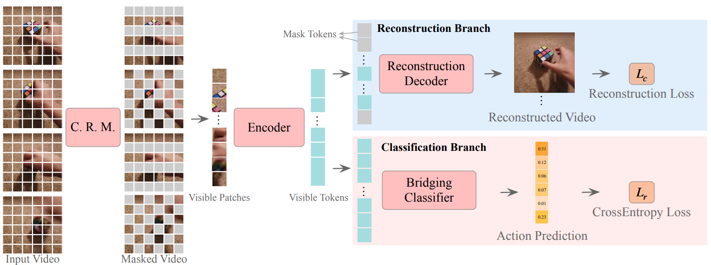

# MAR: Masked Autoencoders for Efficient Action Recognition
[Zhiwu Qing](https://scholar.google.com/citations?user=q9refl4AAAAJ&hl=zh-CN&authuser=1), [Shiwei Zhang](https://www.researchgate.net/profile/Shiwei-Zhang-14), [Ziyuan Huang](https://huang-ziyuan.github.io/), [Xiang Wang](https://scholar.google.com/citations?user=cQbXvkcAAAAJ&hl=zh-CN&oi=sra), Yiliang Lv, [Changxin Gao](https://scholar.google.com/citations?user=4tku-lwAAAAJ&hl=zh-CN), [Nong Sang](https://scholar.google.com/citations?user=ky_ZowEAAAAJ&hl=zh-CN) <br/>
[[Paper]](https://arxiv.org/pdf/2207.11660.pdf).

<br/>
<div align="center">
    
</div>
<br/>

# Latest

[2022-11] Codes are available!

This repo is a modification on the [TAdaConv](https://github.com/alibaba-mmai-research/TAdaConv) repo.
## Installation

Requirements:
- Python>=3.6
- torch>=1.5
- torchvision (version corresponding with torch)
- simplejson==3.11.1
- decord>=0.6.0
- pyyaml
- einops
- oss2
- psutil
- tqdm
- pandas

optional requirements
- fvcore (for flops calculation)

# Guidelines

### Installation, data preparation and running

The general pipeline for using this repo is the installation, data preparation and running.
See [GUIDELINES.md](https://github.com/alibaba-mmai-research/TAdaConv/blob/main/GUIDELINES.md).

# Getting Pre-trained Checkpoints
You can download the Video-MAE pre-trained checkpoints from [here](https://github.com/MCG-NJU/VideoMAE/blob/main/MODEL_ZOO.md).
Next please use this simple python script to convert the pre-trained checkpoints to adapt to our code base.
Then you need modify the `TRAIN.CHECKPOINT_FILE_PATH` to the converted checkpoints for fine-tuning.


# Running instructions
<!-- To train the model with MAR, set the `_BASE_RUN` to point to `configs/pool/run/training/simclr.yaml`. See `configs/projects/hico/simclr_*_s3dg.yaml` for more details. Alternatively, you can also find some pre-trained model in the `MODEL_ZOO.md`. -->


For detailed explanations on the approach itself, please refer to the [paper](https://arxiv.org/pdf/2207.11660.pdf).

For an example run, set the `DATA_ROOT_DIR`, `ANNO_DIR`, `TRAIN.CHECKPOINT_FILE_PATH` and `OUTPUT_DIR` in `configs\projects\mar\ft-ssv2\vit_base_50%.yaml`, and run the command for the training:
```
python tools/run_net.py --cfg configs/projects/mar/ft-ssv2/vit_base_50%.yaml
```


# Citing MAR
If you find MAR useful for your research, please consider citing the paper as follows:
```BibTeX
@article{qing2022mar,
  title={Mar: Masked autoencoders for efficient action recognition},
  author={Qing, Zhiwu and Zhang, Shiwei and Huang, Ziyuan and Wang, Xiang and Wang, Yuehuan and Lv, Yiliang and Gao, Changxin and Sang, Nong},
  journal={arXiv preprint arXiv:2207.11660},
  year={2022}
}
```
